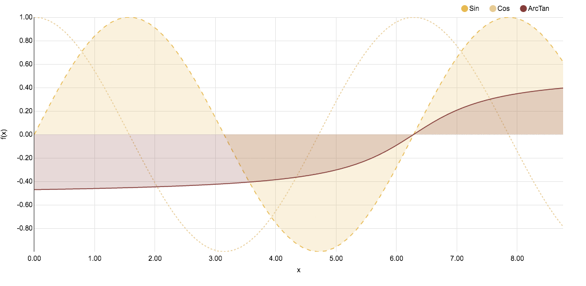

# Python interface to nvd3 for Juypter and Zeppelin notebooks

Tested with:

- Anaconda 4.3.1, python 2.7.13 and python 3.5.2 (jupyter-1.0.0, IPython 5.1.0)


## Usage

### Installation

Install with `pip install .` and then load sample notebook 
    
- [IPython NVD3 Demo](notebooks/NVD3%20Demo.ipynb.ipynb)
- [Zeppelin NVD3 Demo](Zeppelin-Nvd3-Demo.json)


### Notebook

Load NVD3

```python
from nvd3_stat import Nvd3

nv = Nvd3()
nv.reloadNVD3(nvd3version="1.8.5", d3version="3.5.17")
```

#### Plot a line chart

```python
import pandas as pd
import numpy as np

x = np.linspace(0, 4*np.pi, 100)

l_df = pd.DataFrame({"X":x,
                     "Sin":np.sin(x), 
                     "Cos":np.cos(x), 
                     "ArcTan":np.arctan(x-2*np.pi)/3})


lc = nv.lineChart()

config={"height":500, "width": 1024, "color":nv.c20b()[10:13], 
        "yAxis":{"axisLabel":"f(x)", "tickFormat":",.2f"}, 
        "xAxis":{"axisLabel":"x",    "tickFormat":",.2f"},
        "focusEnable": False, "duration":0}
        
lineAttributes={"area":[True, False, True], "fillOpacity":[0.2, 0, 0.2], "style":["dashed", "dotted", None]}

lc.plot(l_df[:70], "X", ["Sin", "Cos", "ArcTan"], lineAttributes, config)

```



Append data to the chart:
```
import time

for i in range(71,100):
    time.sleep(0.05)
    lc.append(l_df[i:i+1])
```


#### Observer Tensorflow learning

Sample Notebook:

- [IPython TensorFlow with nvd3-stat](notebooks/TensorFlow%20with%20nvd3-stat.ipynb)
- [Zeppelin  TensorFlow with nvd3-stat](notebooks/Tensorflow%20tests.json)

```python
# define plot configuration
lmax = 20  # max loss to be plotted

config={"height":500, "width": 500, "color":nv.c10(1,0), "duration":0,
        "xDomain":[0,training_steps],"xAxis":{"axisLabel":"Step", "tickFormat":",d"} }

aConfig = dict(yDomain=[0.95,1], yAxis={"axisLabel":"Accuracy", "tickFormat":",.3f"}, **config)
lConfig = dict(yDomain=[0,lmax], yAxis={"axisLabel":"Loss",     "tickFormat":",.3f"}, **config)


# Create data in the correct format
def data(typ, x, y_test, y_train):
    return {"step":[x], "train_%s"%typ:[y_train], "test_%s"%typ:[y_test]}

al = nv.lineChart()

# create a horizontal plot with two charts
al.hplot([al.chart(data("accuracy", 0, 0, 0),   "step", ["test_accuracy", "train_accuracy"], 
                   config=aConfig),
          al.chart(data("loss", 0, lmax, lmax), "step", ["test_loss",     "train_loss"    ], 
                   config=lConfig)])

# append data to plots
def alAppend(i, a_train, a_test, l_train, l_test):
    al.append(data("accuracy", i, a_train, a_test), chart=0)
    al.append(data("loss",     i, l_train, l_test), chart=1)
```


